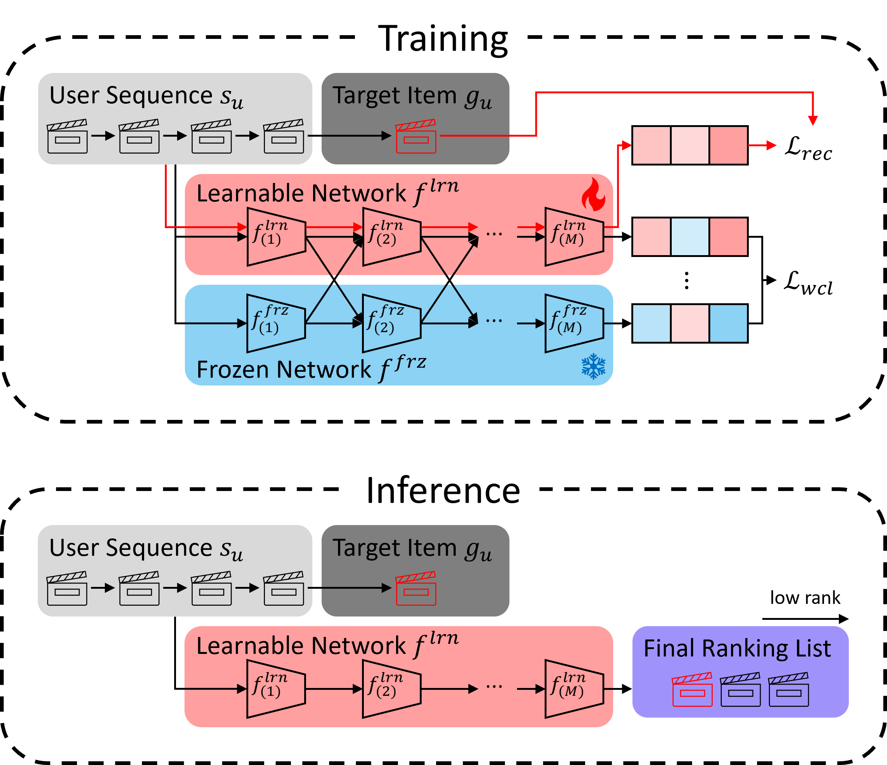

# FLAME
This repository provides the source code of paper, "FLAME: Modular Ensemble with Guided Mutual Learning for Sequential Recommendation."

## 1. Overview


## 2. Environment
```
conda env create --file eny.yml
conda activate flame
```

## 3. Usage
```
python3 train.py --dataset amazon-beauty
```
